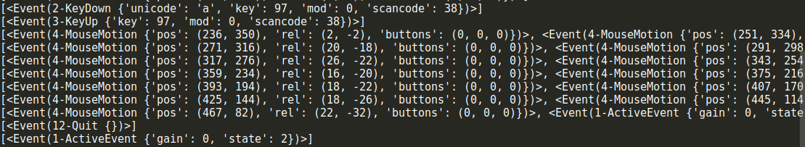

# python项目实战——飞机大战
python基础内容都已学完，一些实用的小项目也设计并实现了几个，但是在设计项目的过程中发现自己对于一些知识点，真正想用的时候很不顺手，所以跟着学习视频做一个完整的飞机大战项目，捡起那些已经被自己遗忘的知识点  
## 目标  
强化面向对象程序设计  
使用pygame模块  
## 运行环境   
linux系统  
安装pygame模块  
```
pip3 install pygame
```
注：pip3 install与pip install的区别：pip调用的是系统安装的pip，对应python2.7版本，并安装文件在相关路径下，直接pip3调用的是python3下的pip，并安装文件在相应目录下  
验证pygame是否安装成功  
```
python3 -m pygame.examples.aliens
```
## 程序设计过程  
### 1 游戏的初始化和退出  
pygame.init和pygame.quit  
注意：init方法主要针对图像绘制窗口处理等模块进行初始化的，对于下文中的Rect方法（只是封装了一些数字计算），不执行pygame.init()也可以直接使用  
[初始化和退出](cate_01_init.py)
### 2 坐标系  
描述坐标系的四个参数（x,y,width,height)  
pygame.Rect专门用来描述矩形区域  
[rect描述坐标系](cate_02_rect.py)  
### 3 创建游戏主窗口  
pygame的模块pygame.display用于创建，管理游戏窗口  
```
pygame.display.set_mode() # 初始化并创建一个游戏窗口  
pygame.display.update() # 刷新窗口内容  
```
```
set_mode(resolution(0,0),flags=0,depth=0) # 缺省参数（已有默认值，调用时可以不指定）
```
 set_mode方法的返回结果是游戏的窗口，后续需要在这个窗口上进行操作，所以要创建一个变量来接受set_mode的返回值，resolution指定屏幕的宽和高  
 ```
 screen = pygame.display.set_mode((480,700))
 ```
 [创建游戏主窗口](cate_03_setmode.py)  
### 4 简单的游戏循环  
启动游戏后，不会立即退出（闪退）,游戏循环就是无限循环  
```
while True:
  pass
```
### 5 绘制图像  
要将图像加载到内存并显示在屏幕上，需要：  
1 pygame.image.load（）加载图像的数据  
2 使用步骤3中创建的游戏屏幕对象，调用blit方法将图像绘制到指定位置  
3 pygame.display.update()更新整个屏幕  
[绘制背景图像](cate_04_background.py)  
[绘制英雄](cate_05_addhero.py)  
注意：可以在所有绘制工作完成之后，同意调用update方法  
### 6 游戏中的动画实现原理  
每次调用update产生的效果称为一个帧frame，一般在电脑上每秒60帧就能产生连续高品质的动画效果  
因此，每秒钟调用60次update  
[update](cate_06_update.py)
### 游戏时钟  
创建时钟对象，使用tick参数来指定while循环内部的代码执行的频率，每秒钟60次  
[游戏时钟](cate_07_clock.py)  
### 英雄的简单动画实现  
1 在游戏初始化时定义一个变量hero_rect记录英雄初始位置  
2 在while循环中每次让英雄坐标y-1，实现向上移动的操作  
3 y<=0时将英雄移动到屏幕的底部  
注：每一次update之前，需要把所有图像重新绘制一遍，而且要最先绘制背景图片（保证图像不会出现叠影）  
[英雄动画](cate_08_herorunning.py)   

### 在游戏循环中监听事件  
事件event：用户针对游戏所做的操作，例如点击关闭按钮，点击鼠标等，同一时间用户可能同时进行多种操作  
监听：捕获到用户的操作并有针对性的做出响应  
pygame中通过pygame.event.get()可以获得用户当前所做的动作列表  
[监听事件](cate_09_event.py)   
  
[监听退出事件](cate_10_quit.py)  
注意：如果监听到退出的动作时，先调用pygame.quit()卸载pygame的所有模块，再调用exit（）直接终止当前正在执行的程序  

### 精灵和精灵组  
在以上的案例中，加载图象，位置变化，绘制图象都过于繁琐  
精灵：存储图像数据和位置rect的对象  
精灵属性：image（记录图象数据），rect（记录在屏幕上的位置）  
精灵方法：
```
update(*args)：更新精灵位置  
kill()：从所有组中删除  
```
精灵组：
```
__init__(self,*精灵)：
add(*sprites):像组中增加精灵  
sprites():返回所有精灵列表  
update(*args):让组中所有精灵调用update方法  
draw(surface):将组中所有精灵的image绘制到surface的rect位置  
```
从这一部分开始，将正式踏入面向对象编程  
创建继承自pygame的精灵子类GameSprite  
```
class GameSprite(pygame.sprite.Sprite)#第一个sprite是模块的名称，第二个Sprite是类名称
```
注意：当开发时，某一个子类的父类不是object基类，要在初始化方法中调用父类的初始化方法  
import与from..import的区别：import调用方法时必须要用“模块名.方法”；from..import可以直接使用方法  

### 实现飞机大战主游戏类  
明确项目的文件和每个文件的职责，一共包括两个py文件，plane_main.py和plane_sprites.py  
plane_main:封装主游戏类，启动游戏  
plane_sprites:封装游戏中所有需要使用的精灵子类，提供游戏相关工具  
注意：在开发时，建议不要用固定的数值，而应该使用常量，如果需要调整数值，则直接修改常量即可  
常量的定义：命名时所有字母都使用大写，单词与单词之间使用下划线连接，常量定义的位置在import之后，class之前  
```
self.screen = pygame.display.set_mode((480, 700))
```
修改为
```
SCREEN_RECT = pygame.Rect(0, 0, 480, 700)
self.screen = pygame.display.set_mode(SCREEN_RECT.size)
```
### 随机敌机位置和速度  
在导入模块时，建议为以下顺序：官方标准模块，第三方模块，应用程序模块  
在plane_sprites.py增加random的导入  

### 移出屏幕销毁敌机  
敌机移出屏幕后，如果没有撞到英雄，需要从敌机组删除，否则会造成内存浪费  
del内置方法会在对象被销毁前调用，可以用来判断对象是否被销毁  
调用kill方法将精灵从从所有组中删除  

### 设计英雄和子弹类  
英雄：  
游戏启动，英雄出现在屏幕的水平中间位置，距离屏幕底部120像素  
英雄每隔0.5秒发射一枚子弹，每次连发3颗子弹  
英雄需要左右方向键控制移动，不能移出屏幕  
子弹：  
从英雄正上方飞出  
飞出屏幕后，需要从精灵组中删除  

### 移动英雄位置  
pygame中捕获键盘按键有两种方式：  
1.判断event.type == pygame.KEYDOWN  


